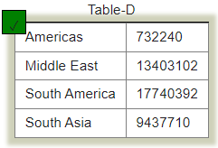

# SQLZoo Solutions

This README file shows the solutions to the [SQLZoo Tutorials](https://www.sqlzoo.net/wiki/SQL_Tutorial). It includes all sections, as well as the quizzes.

## Sections

0. [SELECT basics](#0-select-basics)
1. [SELECT name](#1-select-name)
2. [SELECT from World](#2-select-from-world)
3. [SELECT from Nobel](#3-select-from-nobel)
4. [SELECT within SELECT](#4-select-in-select)
5. [SUM and COUNT](#5-sum-and-count)
6. JOIN
7. More JOIN
8. Using Null
   - 8+. Numeric Examples
9. Self join
   - 9-. Window function
   - 9+. COVID 19 Example

## 0. SELECT basics


1. Show the population of Germany.

```sql
SELECT population
FROM world
WHERE name = 'Germany';
```

2. Show the name and the population for 'Sweden', 'Norway' and 'Denmark'.

```sql
SELECT name, population
FROM world
WHERE name IN ('Sweden', 'Norway', 'Denmark');
```

3. Show the country and the area for countries with an area between 200,000 and 250,000.

```sql
SELECT name, area
FROM world
WHERE area BETWEEN 200000 AND 250000
```

### SELECT Basics quiz

1. Select the code which produces this table:


```sql
SELECT name, population
FROM world
WHERE population BETWEEN 1000000 AND 1250000;
```

2. Pick the result you would obtain from this code:

```sql
SELECT name, population
FROM world
WHERE name LIKE "Al%"
```


3. Select the code which shows the countries that end in A or L.

```sql
SELECT name
FROM world
WHERE name LIKE '%a' OR name LIKE '%l';
```

4. Pick the result from the query

```sql
SELECT name,length(name)
FROM world
WHERE length(name)=5 and region='Europe'
```


5. Pick the result you would obtain from this code:

```sql
SELECT name, area*2
FROM world
WHERE population = 64000
```


6. Select the code that would show the countries with an area larger than 50000 and a population smaller than 10000000.

```sql
SELECT name, area, population
FROM world
WHERE area > 50000 AND population < 10000000
```

7. Select the code that shows the population density of China, Australia, Nigeria and France.

```sql
SELECT name, population/area
FROM world
WHERE name IN ('China', 'Nigeria', 'France', 'Australia')
```

## 1. SELECT name

1. Find the country that start with Y.

```sql
SELECT name
FROM world
WHERE name LIKE 'Y%';
```

2. Find the countries that end with y.

```sql
SELECT name
FROM world
WHERE name LIKE '%y';
```

3. Find the countries that contain the letter x.

```sql
SELECT name
FROM world
WHERE name LIKE '%x%';
```

4. Find the countries that end with land.

```sql
SELECT name
FROM world
WHERE name LIKE '%land'
```

5. Find the countries that start with C and end with ia.

```sql
SELECT name
FROM world
WHERE name LIKE 'C%ia';
```

6. Find the country that has oo in the name.

```sql
SELECT name
FROM world
WHERE name LIKE '%oo%';
```

7. Find the countries that have three or more a in the name.

```sql
SELECT name
FROM world
WHERE name LIKE '%a%a%a%';
```

8. Find the countries that have "t" as the second character.

```sql
SELECT name
FROM world
WHERE name LIKE '_t%'
ORDER BY name;
```

9. Find the countries that have two "o" characters separated by two others.

```sql
SELECT name
FROM world
WHERE name LIKE '%o__o%';
```

10. Find the countries that have exactly four characters.

```sql
SELECT name
FROM world
WHERE name LIKE '\_\_\_\_';
```

11. Find the country where the name is the capital city.

```sql
SELECT name
FROM world
WHERE name LIKE capital;
```

12. Find the country where the capital is the country plus "City".

```sql
SELECT name
FROM world
WHERE capital LIKE concat(name, ' City');
```

13. Find the capital and the name where the capital includes the name of the country.

```sql
SELECT capital, name
FROM world
WHERE capital LIKE CONCAT('%', name, '%');
```

14. Find the capital and the name where the capital is an extension of name of the country. But not where the capital is the same as the country.

```sql
SELECT capital, name
FROM world
WHERE capital LIKE concat(name, '%')
AND capital != name;
```

15. Show the name and the extension where the capital is a proper (non-empty) extension of name of the country.
    -- The capital of Monaco is Monaco-Ville: this is the name Monaco and the extension is -Ville.

```sql
SELECT name, REPLACE(capital, name, '') AS 'Extension'
FROM world
WHERE capital LIKE CONCAT(name, '\_%');
```

## 2. SELECT from World

1. Show the name, continent and population of all countries.

```sql
SELECT name, continent, population
FROM world;
```

2. Show the name for the countries that have a population of at least 200 million.

```sql
SELECT name
FROM world
WHERE population >= 200000000;
```

3. Give the name and the per capita GDP for those countries with a population of at least 200 million.

```sql
SELECT name, gdp/population 'Per Capita GDP'
FROM world
WHERE population >=200000000;
```

4. Show the name and population in millions for the countries of the continent 'South America'.

```sql
SELECT name, population/1000000 AS 'Population'
FROM world
WHERE continent = 'South America';
```

5. Show the name and population for France, Germany, Italy.

```sql
SELECT  name, population
FROM world
WHERE name IN ('France', 'Germany', 'Italy');
```

6. Show the countries which have a name that includes the word 'United'.

```sql
SELECT name
FROM world
WHERE name LIKE '%united%';
```

7. Show the countries that are big by area or big by population. Show name, population and area.

```sql
SELECT name, population, area
FROM world
WHERE area > 3000000
OR population > 250000000;
```

8. Show the countries that are big by area (more than 3 million) or big by population (more than 250 million) but not both. Show name, population and area.

```sql
SELECT name, population, area
FROM world
WHERE area > 3000000
XOR population > 250000000;
```

9. Show the name and population in millions and the GDP in billions for the countries of the continent 'South America'.

```sql
SELECT name, ROUND(population/1000000, 2) AS 'Population (millions)', ROUND(GDP/1000000000, 2) AS 'GDP (billions)'
FROM world
WHERE continent = 'South America';
```

10. Show per-capita GDP for the trillion dollar countries to the nearest $1000.

```sql
SELECT name, ROUND(GDP/population, -3) AS 'Per-Capita GDP'
FROM world
WHERE GDP > 1000000000000;
```

11. Show the name and capital where the name and the capital have the same number of characters.

```sql
SELECT name, capital
FROM world
WHERE LENGTH(name) = LENGTH(capital);
```

12. Show the name and the capital where the first letters of each match. Don't include countries where the name and the capital are the same word.

```sql
SELECT name, capital
FROM world
WHERE LEFT(name, 1) = LEFT(capital,1)
AND name <> capital;
```

13. Find the country that has all the vowels and no spaces in its name.

```sql
SELECT name
FROM world
WHERE name LIKE '%a%'
AND name LIKE '%e%'
AND name LIKE '%i%'
AND name LIKE '%o%'
AND name LIKE '%u%'
AND name NOT LIKE '% %';
```

### SELECT from World BBC Quiz


1. Select the code which gives the name of countries beginning with U.

```sql
SELECT name
FROM world
WHERE name LIKE 'U%'
```

2. Select the code which shows just the population of United Kingdom.

```sql
SELECT population
FROM world
WHERE name = 'United Kingdom'
```

3. Select the answer which shows the problem with this SQL code - the intended result should be the continent of France:

```sql
SELECT continent
FROM world
WHERE 'name' = 'France'
```

-- B - 'name' should be name

4. Select the result that would be obtained from the following code:

```sql
SELECT name, population / 10
FROM world
WHERE population < 10000
```


5. Select the code which would reveal the name and population of countries in Europe and Asia.

```sql
SELECT name, population
FROM world
WHERE continent IN ('Europe', 'Asia')
```

6. Select the code which would give two rows.

```sql
SELECT name FROM world
WHERE name IN ('Cuba', 'Togo')
```

7. Select the result that would be obtained from this code:

```sql
SELECT name FROM world
WHERE continent = 'South America'
AND population > 40000000
```


## 3. SELECT from Nobel

Table of Nobel prize winners: nobel(yr, subject, winner)

1. Display Nobel prizes for 1950.

```sql
SELECT yr, subject, winner
FROM nobel
WHERE yr = 1950;
```

2. Show who won the 1962 prize for literature.

```sql
SELECT winner
FROM nobel
WHERE yr = 1962
AND subject = 'literature';
```

3. Show the year and subject that won 'Albert Einstein' his prize.

```sql
SELECT yr, subject
FROM nobel
WHERE winner = 'Albert Einstein';
```

4. Give the name of the 'peace' winners since the year 2000, including 2000.

```sql
SELECT winner
FROM nobel
WHERE yr >= 2000
AND subject = 'peace';
```

5. Show all details (yr, subject, winner) of the literature prize winners for 1980 to 1989 inclusive.

```sql
SELECT yr, subject, winner
FROM nobel
WHERE subject = 'literature'
AND yr BETWEEN 1980 AND 1989;
```

6. Show all details of the presidential winners: Theodore Roosevelt, Thomas Woodrow Wilson, Jimmy Carter, Barack Obama.

```sql
SELECT * FROM nobel
WHERE subject = 'peace'
AND winner IN ('Theodore Roosevelt',
				'Thomas Woodrow Wilson',
				'Jimmy Carter',
				'Barack Obama');
```

7. Show the winners with first name John.

```sql
SELECT winner
FROM nobel
WHERE winner LIKE 'John%';
```

8. Show the year, subject, and name of physics winners for 1980 together with the chemistry winners for 1984.

```sql
SELECT yr, subject, winner
FROM nobel
WHERE (yr = 1980
	AND subject = 'physics')
	OR (yr = 1984
	AND subject = 'chemistry');
```

9. Show the year, subject, and name of winners for 1980 excluding chemistry and medicine.

```sql
SELECT yr, subject, winner
FROM nobel
WHERE yr = 1980
	AND subject NOT IN ('chemistry', 'medicine');
```

10. Show year, subject, and name of people who won a 'Medicine' prize in an early year (before 1910, not including 1910) together with winners of a 'Literature' prize in a later year (after 2004, including 2004).

```sql
SELECT yr, subject, winner
FROM nobel
WHERE (yr < 1910
	AND subject = 'medicine')
	OR (yr >= 2004
	AND subject = 'literature');
```

11. Find all details of the prize won by PETER GRÜNBERG.

```sql
SELECT *
FROM nobel
WHERE winner = 'PETER GRÜNBERG';
```

12. Find all details of the prize won by EUGENE O'NEILL.

```sql
SELECT *
FROM nobel
WHERE winner = "EUGENE O'NEILL";
```

13. List the winners, year and subject where the winner starts with Sir. Show the the most recent first, then by name order.

```sql
SELECT winner, yr, subject
FROM nobel
WHERE winner LIKE 'Sir%'
ORDER BY yr desc, winner;
```

14. Show the 1984 winners and subject ordered by subject and winner name; but list chemistry and physics last.

```sql
SELECT winner, subject
FROM nobel
WHERE yr=1984
ORDER BY subject IN ('physics','chemistry'), subject, winner;
-- Legal SQL for more portability:
-- ORDER BY
-- CASE WHEN subject IN ('physics', 'chemistry') THEN 1 ELSE 0 END, subject, winner;
```

### SELECT from Nobel Quiz


1. Pick the code which shows the name of winner's names beginning with C and ending in n.

```sql
SELECT winner FROM nobel
WHERE winner LIKE 'C%' AND winner LIKE '%n'
```

2. Select the code that shows how many Chemistry awards were given between 1950 and 1960.

```sql
SELECT COUNT(subject) FROM nobel
WHERE subject = 'Chemistry'
AND yr BETWEEN 1950 and 1960
```

3. Pick the code that shows the amount of years where no Medicine awards were given.

```sql
SELECT COUNT(DISTINCT yr) FROM nobel
WHERE yr NOT IN (SELECT DISTINCT yr FROM nobel WHERE subject = 'Medicine')
```

4. Select the result that would be obtained from the following code:

```sql
SELECT subject, winner FROM nobel WHERE winner LIKE 'Sir%' AND yr LIKE '196%'
```


5. Select the code which would show the year when neither a Physics or Chemistry award was given.

```sql
SELECT yr FROM nobel
WHERE yr NOT IN(SELECT yr
				FROM nobel
				WHERE subject IN ('Chemistry','Physics'))
```

6. Select the code which shows the years when a Medicine award was given but no Peace or Literature award was.

```sql
SELECT DISTINCT yr
FROM nobel
WHERE subject='Medicine'
AND yr NOT IN(SELECT yr FROM nobel
				WHERE subject='Literature')
AND yr NOT IN (SELECT yr FROM nobel
				WHERE subject='Peace')
```

7. Pick the result that would be obtained from the following code:

```sql
SELECT subject, COUNT(subject)
FROM nobel
WHERE yr ='1960'
GROUP BY subject
```


## 4. SELECT in SELECT


1. List each country name where the population is larger than that of 'Russia'.

```sql
SELECT name
FROM world
WHERE population >
	(SELECT population FROM world
	WHERE name='Russia');
```

2. Show the countries in Europe with a per capita GDP greater than 'United Kingdom'.

```sql
SELECT name
FROM world
WHERE continent = 'Europe'
AND gdp/population > (SELECT gdp/population
                      FROM world
                      WHERE name = 'United Kingdom');
```

3. List the name and continent of countries in the continents containing either Argentina or Australia. Order by name of the country.

```sql
SELECT name,
		continent
FROM world
WHERE continent IN (SELECT continent
					FROM world
					WHERE name = 'Argentina'
					OR name = 'Australia')
ORDER BY name;
```

4. Which country has a population that is more than United Kingdom but less than Germany? Show the name and the population.

```sql
SELECT name,
		population
FROM world
WHERE population > (SELECT population
					FROM world
					WHERE name = 'United Kingdom')
AND population < (SELECT population
				FROM world
				WHERE name = 'Germany');
```

5. Show the name and the population of each country in Europe. Show the population as a percentage of the population of Germany.

```sql
SELECT name,
		CONCAT(ROUND(population/(SELECT population
								FROM world
								WHERE name = 'Germany')
					*100, 0), '%') AS 'percentage'
FROM world
WHERE continent = 'Europe';
```

6. Which countries have a GDP greater than every country in Europe? [Give the name only.] (Some countries may have NULL gdp values)

```sql
SELECT name
FROM world
WHERE gdp > (SELECT MAX(gdp)
			FROM world
			WHERE continent = 'Europe');
```

7. Find the largest country (by area) in each continent, show the continent, the name and the area. Use a correlated/synchronized sub-query.

```sql
SELECT continent, name, area
FROM world AS x
WHERE area >= ALL (SELECT area
					FROM world AS y
					WHERE y.continent = x.continent);
```

8. List each continent and the name of the country that comes first alphabetically.

```sql
SELECT continent, name
FROM world AS x
WHERE name <= ALL (SELECT name
					FROM world AS y
					WHERE x.continent = y.continent);
```

9. Find the continents where all countries have a population <= 25000000. Then find the names of the countries associated with these continents. Show name, continent and population.

```sql
SELECT name, continent, population
FROM world
WHERE continent NOT IN (SELECT DISTINCT continent
						FROM world
						WHERE population <= 25000000);
```

10. Some countries have populations more than three times that of all of their neighbours (in the same continent). Give the countries and continents.

```sql
SELECT name, continent
FROM world AS x
WHERE population > ALL(SELECT population * 3
						FROM world AS y
						WHERE x.continent = y.continent
						AND x.name <> y.name);
```

### Nested SELECT Quiz


1. Select the code that shows the name, region and population of the smallest country in each region

```sql
SELECT region, name, population
FROM bbc x
WHERE population <= ALL (SELECT population
						FROM bbc y
						WHERE y.region=x.region
						AND population>0)
```

2. Select the code that shows the countries belonging to regions with all populations over 50000

```sql
SELECT name,region,population
FROM bbc x
WHERE 50000 < ALL (SELECT population
					FROM bbc y
					WHERE x.region=y.region
					AND y.population>0)
```

3. Select the code that shows the countries with a less than a third of the population of the countries around it

```sql
SELECT name, region
FROM bbc x
WHERE population < ALL (SELECT population/3
						FROM bbc y
						WHERE y.region = x.region
						AND y.name != x.name)
```

4. Select the result that would be obtained from the following code:

```sql
SELECT name FROM bbc
WHERE population >
	(SELECT population
		FROM bbc
		WHERE name='United Kingdom')
AND region IN
	(SELECT region
		FROM bbc
		WHERE name = 'United Kingdom')
```


5. Select the code that would show the countries with a greater GDP than any country in Africa (some countries may have NULL gdp values).

```sql
SELECT name
FROM bbc
WHERE gdp > (SELECT MAX(gdp)
			FROM bbc
			WHERE region = 'Africa')
```

6. Select the code that shows the countries with population smaller than Russia but bigger than Denmark.

```sql
SELECT name
FROM bbc
WHERE population < (SELECT population FROM bbc WHERE name='Russia')
AND population > (SELECT population FROM bbc WHERE name='Denmark')
```

7. Select the result that would be obtained from the following code:

```sql
SELECT name FROM bbc
WHERE population > ALL
	(SELECT MAX(population)
	FROM bbc
	WHERE region = 'Europe')
AND region = 'South Asia'
```


## 5. SUM and COUNT

1. Show the total population of the world.

```sql
SELECT SUM(population)
FROM world;
```

2. List all the continents - just once each.

```sql
SELECT DISTINCT continent
FROM world;
```

3. Give the total GDP of Africa.

```sql
SELECT SUM(gdp)
FROM world
WHERE continent = 'Africa';
```

4. How many countries have an area of at least 1000000.

```sql
SELECT COUNT(area)
FROM world
WHERE area >= 1000000;
```

5. What is the total population of ('Estonia', 'Latvia', 'Lithuania')?

```sql
SELECT SUM(population)
FROM world
WHERE name IN ('Estonia',
				'Latvia',
				'Lithuania');
```

6. For each continent show the continent and number of countries.

```sql
SELECT continent, COUNT(name)
FROM world
GROUP BY continent;
```

7. For each continent show the continent and number of countries with populations of at least 10 million.

```sql
SELECT continent, COUNT(name)
FROM world
WHERE population >= 10000000
GROUP BY continent;
```

8. List the continents that have a total population of at least 100 million.

```sql
SELECT continent
FROM world
GROUP BY continent
HAVING SUM(population) >= 100000000;
```

### SUM and COUNT quiz


1. Select the statement that shows the sum of population of all countries in 'Europe'.

```sql
SELECT SUM(population) FROM bbc WHERE region = 'Europe'
```

2. Select the statement that shows the number of countries with population smaller than 150000.

```sql
SELECT COUNT(name) FROM bbc WHERE population < 150000
```

3. Select the list of core SQL aggregate functions.

```sql
AVG(), COUNT(), MAX(), MIN(), SUM()
```

4. Select the result that would be obtained from the following code:

```sql
SELECT region, SUM(area)
FROM bbc
WHERE SUM(area) > 15000000
GROUP BY region
-- D - No result due to invalid use of the WHERE function
```

5. Select the statement that shows the average population of 'Poland', 'Germany' and 'Denmark'.

```sql
SELECT AVG(population) FROM bbc WHERE name IN ('Poland', 'Germany', 'Denmark')
```

6. Select the statement that shows the medium population density of each region.

```sql
SELECT region, SUM(population)/SUM(area) AS density FROM bbc GROUP BY region
```

7. Select the statement that shows the name and population density of the country with the largest population.

```sql
SELECT name, population/area AS density FROM bbc WHERE population = (SELECT MAX(population) FROM bbc)
```

8. Pick the result that would be obtained from the following code:

```sql
 SELECT region, SUM(area)
FROM bbc
GROUP BY region
HAVING SUM(area)<= 20000000
```


