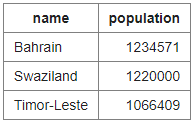

# SQLZoo Solutions

This README file shows the solutions to the [SQLZoo Tutorials](https://www.sqlzoo.net/wiki/SQL_Tutorial). It includes all sections, as well as the quizzes.

## Sections

0. [SELECT basics](#0-select-basics)
1. [SELECT name](#1-select-name)
2. [SELECT from World](#2-select-from-world)
3. SELECT from Nobel
4. SELECT within SELECT
5. SUM and COUNT
6. JOIN
7. More JOIN
8. Using Null
   - 8+. Numeric Examples
9. Self join
   - 9-. Window function
   - 9+. COVID 19 Example

## 0. SELECT basics


1. Show the population of Germany.

```sql
SELECT population
FROM world
WHERE name = 'Germany';
```

2. Show the name and the population for 'Sweden', 'Norway' and 'Denmark'.

```sql
SELECT name, population
FROM world
WHERE name IN ('Sweden', 'Norway', 'Denmark');
```

3. Show the country and the area for countries with an area between 200,000 and 250,000.

```sql
SELECT name, area
FROM world
WHERE area BETWEEN 200000 AND 250000
```

### SELECT Basics quiz

1. Select the code which produces this table:



```sql
SELECT name, population
FROM world
WHERE population BETWEEN 1000000 AND 1250000;
```

2. Pick the result you would obtain from this code:

```sql
SELECT name, population
FROM world
WHERE name LIKE "Al%"
```


3. Select the code which shows the countries that end in A or L.

```sql
SELECT name
FROM world
WHERE name LIKE '%a' OR name LIKE '%l';
```

4. Pick the result from the query

```sql
SELECT name,length(name)
FROM world
WHERE length(name)=5 and region='Europe'
```


5. Pick the result you would obtain from this code:

```sql
SELECT name, area*2
FROM world
WHERE population = 64000
```


6. Select the code that would show the countries with an area larger than 50000 and a population smaller than 10000000.

```sql
SELECT name, area, population
FROM world
WHERE area > 50000 AND population < 10000000
```

7. Select the code that shows the population density of China, Australia, Nigeria and France.

```sql
SELECT name, population/area
FROM world
WHERE name IN ('China', 'Nigeria', 'France', 'Australia')
```

## 1. SELECT name

1. Find the country that start with Y.

```sql
SELECT name
FROM world
WHERE name LIKE 'Y%';
```

2. Find the countries that end with y.

```sql
SELECT name
FROM world
WHERE name LIKE '%y';
```

3. Find the countries that contain the letter x.

```sql
SELECT name
FROM world
WHERE name LIKE '%x%';
```

4. Find the countries that end with land.

```sql
SELECT name
FROM world
WHERE name LIKE '%land'
```

5. Find the countries that start with C and end with ia.

```sql
SELECT name
FROM world
WHERE name LIKE 'C%ia';
```

6. Find the country that has oo in the name.

```sql
SELECT name
FROM world
WHERE name LIKE '%oo%';
```

7. Find the countries that have three or more a in the name.

```sql
SELECT name
FROM world
WHERE name LIKE '%a%a%a%';
```

8. Find the countries that have "t" as the second character.

```sql
SELECT name
FROM world
WHERE name LIKE '_t%'
ORDER BY name;
```

9. Find the countries that have two "o" characters separated by two others.

```sql
SELECT name
FROM world
WHERE name LIKE '%o__o%';
```

10. Find the countries that have exactly four characters.

```sql
SELECT name
FROM world
WHERE name LIKE '\_\_\_\_';
```

11. Find the country where the name is the capital city.

```sql
SELECT name
FROM world
WHERE name LIKE capital;
```

12. Find the country where the capital is the country plus "City".

```sql
SELECT name
FROM world
WHERE capital LIKE concat(name, ' City');
```

13. Find the capital and the name where the capital includes the name of the country.

```sql
SELECT capital, name
FROM world
WHERE capital LIKE CONCAT('%', name, '%');
```

14. Find the capital and the name where the capital is an extension of name of the country. But not where the capital is the same as the country.

```sql
SELECT capital, name
FROM world
WHERE capital LIKE concat(name, '%')
AND capital != name;
```

15. Show the name and the extension where the capital is a proper (non-empty) extension of name of the country.
    -- The capital of Monaco is Monaco-Ville: this is the name Monaco and the extension is -Ville.

```sql
SELECT name, REPLACE(capital, name, '') AS 'Extension'
FROM world
WHERE capital LIKE CONCAT(name, '\_%');
```

## 2. SELECT from World

1. Show the name, continent and population of all countries.

```sql
SELECT name, continent, population
FROM world;
```

2. Show the name for the countries that have a population of at least 200 million.

```sql
SELECT name
FROM world
WHERE population >= 200000000;
```

3. Give the name and the per capita GDP for those countries with a population of at least 200 million.

```sql
SELECT name, gdp/population 'Per Capita GDP'
FROM world
WHERE population >=200000000;
```

4. Show the name and population in millions for the countries of the continent 'South America'.

```sql
SELECT name, population/1000000 AS 'Population'
FROM world
WHERE continent = 'South America';
```

5. Show the name and population for France, Germany, Italy.

```sql
SELECT  name, population
FROM world
WHERE name IN ('France', 'Germany', 'Italy');
```

6. Show the countries which have a name that includes the word 'United'.

```sql
SELECT name
FROM world
WHERE name LIKE '%united%';
```

7. Show the countries that are big by area or big by population. Show name, population and area.

```sql
SELECT name, population, area
FROM world
WHERE area > 3000000
OR population > 250000000;
```

8. Show the countries that are big by area (more than 3 million) or big by population (more than 250 million) but not both. Show name, population and area.

```sql
SELECT name, population, area
FROM world
WHERE area > 3000000
XOR population > 250000000;
```

9. Show the name and population in millions and the GDP in billions for the countries of the continent 'South America'.

```sql
SELECT name, ROUND(population/1000000, 2) AS 'Population (millions)', ROUND(GDP/1000000000, 2) AS 'GDP (billions)'
FROM world
WHERE continent = 'South America';
```

10. Show per-capita GDP for the trillion dollar countries to the nearest $1000.

```sql
SELECT name, ROUND(GDP/population, -3) AS 'Per-Capita GDP'
FROM world
WHERE GDP > 1000000000000;
```

11. Show the name and capital where the name and the capital have the same number of characters.

```sql
SELECT name, capital
FROM world
WHERE LENGTH(name) = LENGTH(capital);
```

12. Show the name and the capital where the first letters of each match. Don't include countries where the name and the capital are the same word.

```sql
SELECT name, capital
FROM world
WHERE LEFT(name, 1) = LEFT(capital,1)
AND name <> capital;
```

13. Find the country that has all the vowels and no spaces in its name.

```sql
SELECT name
FROM world
WHERE name LIKE '%a%'
AND name LIKE '%e%'
AND name LIKE '%i%'
AND name LIKE '%o%'
AND name LIKE '%u%'
AND name NOT LIKE '% %';
```

### SELECT from World BBC Quiz


1. Select the code which gives the name of countries beginning with U.

```sql
SELECT name
FROM world
WHERE name LIKE 'U%'
```

2. Select the code which shows just the population of United Kingdom.

```sql
SELECT population
FROM world
WHERE name = 'United Kingdom'
```

3. Select the answer which shows the problem with this SQL code - the intended result should be the continent of France:

```sql
SELECT continent
FROM world
WHERE 'name' = 'France'
```

-- B - 'name' should be name

4. Select the result that would be obtained from the following code:

```sql
SELECT name, population / 10
FROM world
WHERE population < 10000
```


5. Select the code which would reveal the name and population of countries in Europe and Asia.

```sql
SELECT name, population
FROM world
WHERE continent IN ('Europe', 'Asia')
```

6. Select the code which would give two rows.

```sql
SELECT name FROM world
WHERE name IN ('Cuba', 'Togo')
```

7. Select the result that would be obtained from this code:

```sql
SELECT name FROM world
WHERE continent = 'South America'
AND population > 40000000
```


